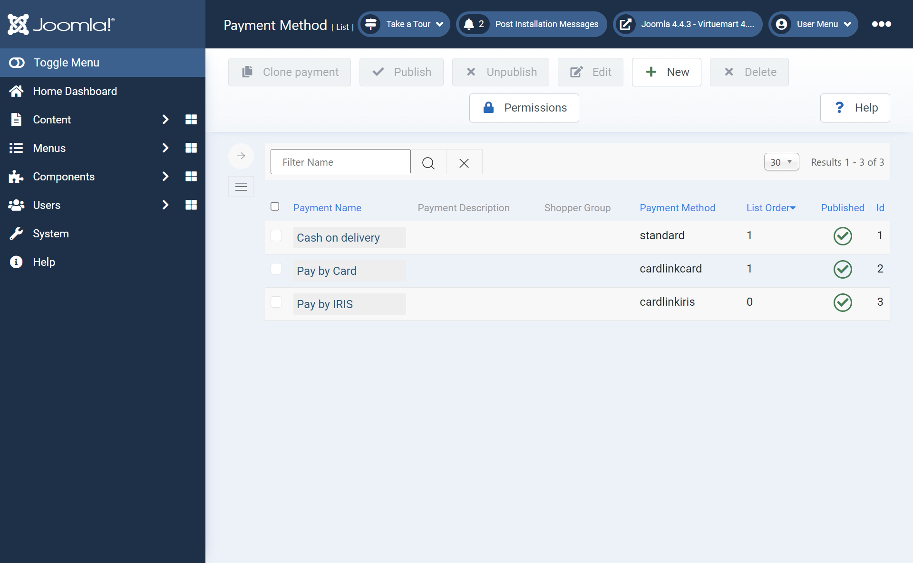
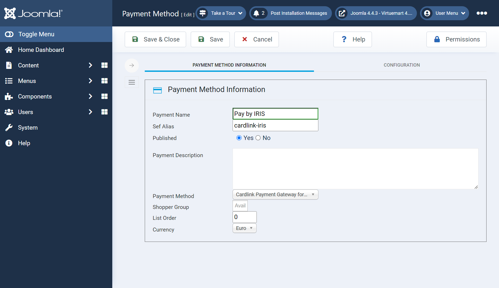
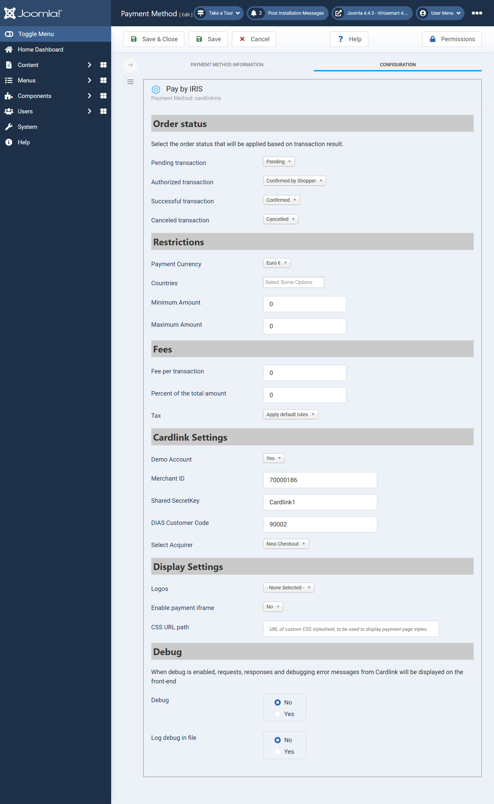

# Cardlink Checkout Payment Gateway for VirtueMart

- Contributors: cardlink
- Tags: payments, payment-gateway
- Requires at least: Joomla 4.1.0, VirtueMart 4.x
- Tested up to: Joomle 4.4.8, VirtueMart 4.2.4
- Requires PHP: 7.x - 8.x
- License: GPLv2 or later
- License URI: http://www.gnu.org/licenses/gpl-2.0.html

## Changelog
- **1.1.3**
  - Remove requirement for IRIS customer code configuration setting.
- **1.1.2**
  - Add Cardlink and Worldline as IRIS business partners.
- **1.1.1**
  - Minor fixes.
  - Updated README.
- **1.1.0**
  - Added support for IRIS payments.
- **1.0.1**
  - Optimized digest validation process.
- **1.0.0**
  - Initial release.

##  Support tickets

In case that you face any technical issue during the installation process, you can contact the Cardlink e-commerce team at ecommerce_support@cardlink.gr .

## Description

Cardlink Payment Gateway allows you to accept payment through various schemes such as Visa, Mastercard, Maestro, American Express, Diners, Discover cards on your website, with or without variable installments.
This module aims to offer new payment solutions to Cardlink merchants for their VirtueMart 4.x online store without having web development knowledge. However, for the initial module installation some technical knowledge will be required.

Merchants with e-shops (redirect cases only) will be able to integrate the Cardlink Payment Gateway to their checkout page using the CSS layout that they want. Also, they could choose between redirect or IFRAME option for the payment environment. Once the payment is made, the customer returns to the online store and the order is updated.
Once you have completed the requested tests and any changes to your website, you can activate your account and start accepting payments. 

## Features

1. A dropdown option for instance between Worldline, Nexi and Cardlink business partner.
2. Option to enable test environment (sandbox). All transactions will be re-directed to the endpoint that represents the production environment by default. The endpoint will be different depending on which acquirer has been chosen from instance dropdown option.
3. Ability to define the maximum number of installments regardless of the total order amount.
4. Ability to define the ranges of the total order amounts and the maximum number of installments for each range.
5. Option for pre-authorization or sale transactions.
6. Option for a user tokenization service. The card token will be stored in the merchant’s e-shop database and will be used by customers to auto-complete future payments. 
7. In-store checkout option: the merchant can configure the payment process to take place inside a pop up with IFRAME to mask the redirection process from the customers.
8. A text field for providing the absolute or relative (to Cardlink Payment Gateway location on server) URL of custom CSS stylesheet, to apply custom CSS styles in the payment page.
9. Translation ready for Greek & English languages.
10. Automatically cancel pending payment orders after a configurable number of minutes using Joomla Scheduled Tasks.
11.	Support for IRIS payments for Worldline, Nexi and Cardlink acquirers.
12.	The IFRAME feature is not supported for IRIS payments


## Installation and Configuration

Download the Github repository archive and then upload it to your Joomla installation through the System > Install > Extensions menu options on your administrator panel.
Normally, if an order is abandoned (not paid), the order status will remain at Pending. You can use a scheduled task to automatically cancel orders that haven't been paid within a configurable amount of time. Go to System > Manage > Scheduled Tasks, then click the Add New button and select the "Cardlink - Auto cancel unpaid orders" as the task type. On the edit page, set a name for the task, the execution interval to 1 minute and then the number of minutes to wait for orders in pending payment state to be successfully paid for before automatically cancelling the order.


## Required Hosting Configuration Step

#### Apache Web Server

For hosting solutions running the Apache web server software, you will need to add the following lines to your web site’s root ``.htaccess`` file. These will manipulate all cookies set by your VirtueMart store to allow customer sessions to persist after returning from the payment gateway. If you fail to properly set these, customers returning from the payment gateway will be automatically logged out from their accounts.

```
<IfModule mod_headers.c>
Header always edit Set-Cookie ^(.*)$ $1;SameSite=None;Secure
</IfModule>
```

#### Nginx Web Server

If your hosting provider uses the Nginx web server instead, you will need to add/edit the following lines of code to your virtual host’s configuration file.

```
location / {
    proxy_cookie_path / "/; SameSite=None; Secure";
    …
}
```

### Plesk Hosting Control Panel

If you are using Plesk and nginx in proxy mode, under ``Apache & nginx Setting for ... > Additional nginx directives`` add only the following line:

```
proxy_cookie_path / "/; SameSite=None; Secure";
```

If you are only using Apache, add the following configuration lines in the ``Additional Apache directives`` section on the same page. By default, Plesk has the Apache ``mod_headers`` module installed and active however, verify that this is the case for your Plesk installation.

```
<IfModule mod_headers.c>
Header always edit Set-Cookie ^(.*)$ $1;SameSite=None;Secure
</IfModule>
```

If you are unsure or unfamiliar with the actions described above, please ask a trained IT person or contact your hosting provider to do them for you.


If you are unsure or unfamiliar with the actions described above, please ask a trained IT person or contact your hosting provider to do them for you.


## IRIS Payments Setup

To set up IRIS payments, you will need to have the Merchant ID and Shared Secret specifically issued for use with IRIS. Other settings are similar to the ones for Card Payments.



